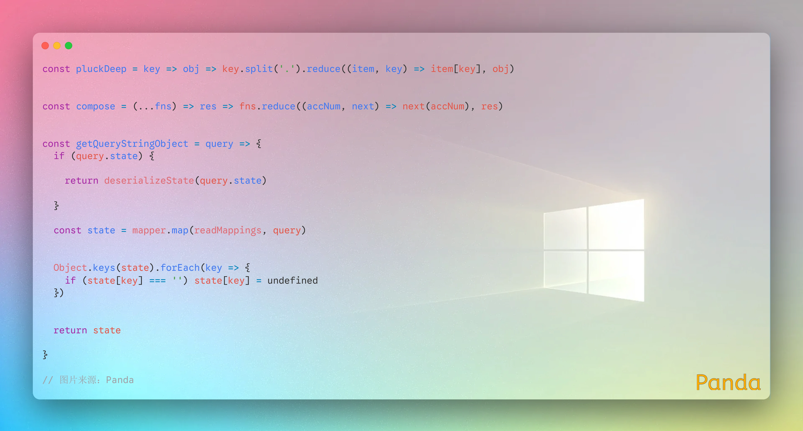
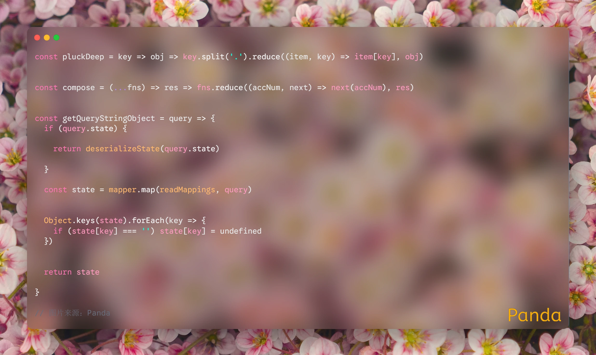
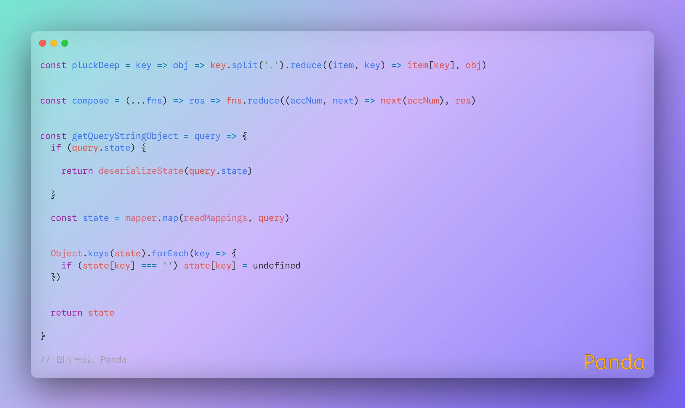
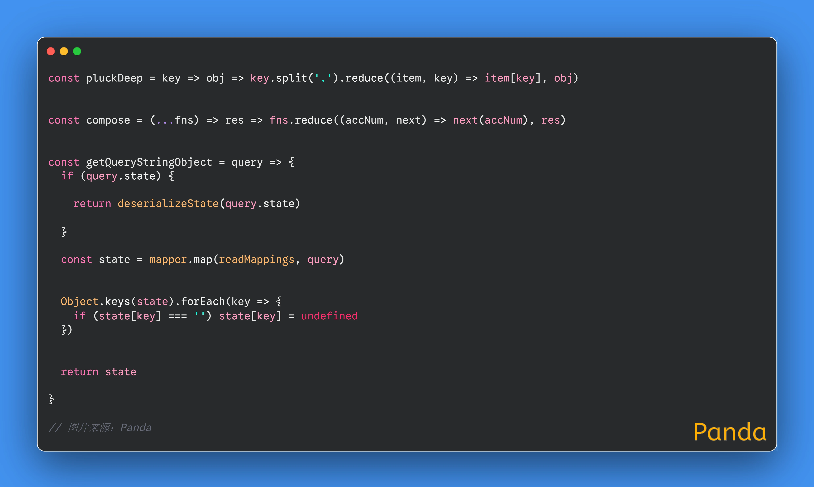
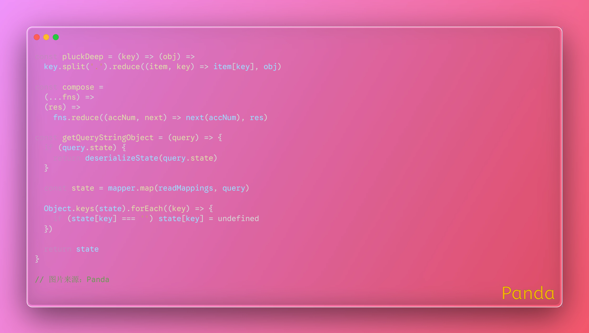
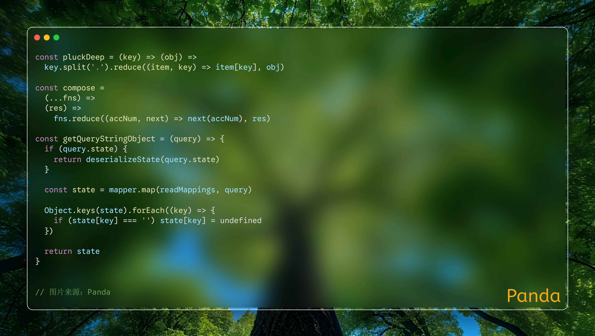
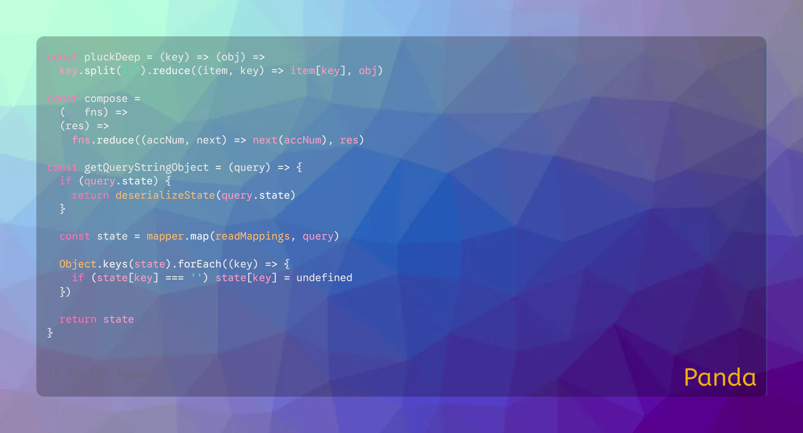
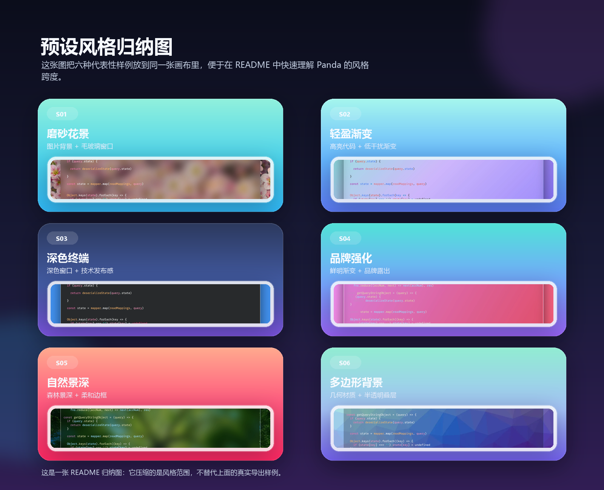
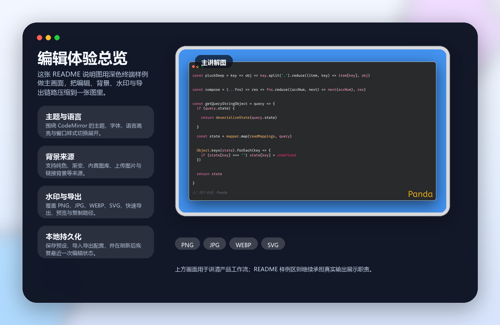

<div align="center">
  

  <h1>Panda</h1>
  <p>将源码整理成更适合分享、展示与发布的代码海报。</p>
  <p>
    在线预览：
    <a href="https://pandajs404.github.io/panda-image">https://pandajs404.github.io/panda-image</a>
  </p>
  <p>
    <a href="#overview">项目简介</a> ·
    <a href="#showcase">样例展示</a> ·
    <a href="#product-breakdown">产品能力拆解</a> ·
    <a href="#engineering-breakdown">工程实现拆解</a> ·
    <a href="#quickstart">快速开始</a> ·
    <a href="#development">开发说明</a>
  </p>
</div>

<a id="overview"></a>

## 项目简介

Panda 是一个面向技术写作、社交媒体发布、演讲配图和文档封面的代码海报生成工具。它的核心目标不是做一个通用代码编辑器，而是把“代码内容 + 视觉样式 + 导出分享”这条链路压缩到一个足够顺手的页面里，让你更快得到一张可以直接发出去的图片。

从当前仓库实现来看，Panda 已经打通了这几类能力：代码输入与高亮、背景系统、窗口样式、导出菜单、剪贴板复制、本地持久化、配置导入导出、自定义预设，以及随机壁纸来源。换句话说，它已经不是单纯的样例页，而是一套比较完整的代码截图美化工作流。

如果你想先看最终效果，再决定是否本地运行，可以直接访问在线预览：[https://pandajs404.github.io/panda-image](https://pandajs404.github.io/panda-image)。

下面这张 `hero-cover.png` 是 README 使用的品牌总览图。它基于 `export-sample` 系列重组，用来把成品气质、风格跨度和导出场景压缩到一张图里，而不是替代真实样例。


---

<a id="showcase"></a>

## 样例展示

### 首屏主图

下面这张主图直接使用仓库现有的 `export-sample.webp`。它能代表 Panda 当前最完整的一类输出结果：玻璃质感代码窗口、模糊背景、阴影、来源标记和品牌水印同时成立。



### 样例列表

这组样例全部来自现有 `export-sample*.webp` 资源。每张图都对应一种不同的视觉侧重点，便于快速理解 Panda 在背景、窗口样式、氛围和品牌呈现上的变化空间。

<table>
  <tr>
    <td align="center">
      
      <br />
      <strong>磨砂花景</strong>
      <br />
      突出图片背景与毛玻璃窗口的柔和氛围。
    </td>
  </tr>
  <tr>
    <td align="center">
      
      <br />
      <strong>轻盈渐变</strong>
      <br />
      突出高亮代码与低干扰渐变背景的平衡。
    </td>
  </tr>
  <tr>
    <td align="center">
      
      <br />
      <strong>深色终端</strong>
      <br />
      突出深色编辑区、清晰边框与稳定的技术发布观感。
    </td>
  </tr>
  <tr>
    <td align="center">
      
      <br />
      <strong>品牌强化</strong>
      <br />
      突出鲜明渐变、品牌露出和更强的视觉记忆点。
    </td>
  </tr>
  <tr>
    <td align="center">
      
      <br />
      <strong>自然景深</strong>
      <br />
      突出森林场景、模糊层次和轻边框窗口的融合。
    </td>
  </tr>
  <tr>
    <td align="center">
      
      <br />
      <strong>多边形背景</strong>
      <br />
      突出几何背景素材与半透明窗口叠加效果。
    </td>
  </tr>
</table>

这些样例共同说明了一点：Panda 的重点不是单一主题，而是让同一段代码在不同背景、边框、透明度和品牌元素下快速切换成不同发布风格。



---

<a id="product-breakdown"></a>

## 产品能力拆解

在进入四个能力层之前，可以先看这张 `editor-showcase.png`。它以 `export-sample3.webp` 为主画面，把编辑区、背景来源、水印和导出能力浓缩到一个讲解视图里，帮助快速建立对 Panda 工作流的整体认识。



### 1. 输出结果层

你能做什么：把一段源码变成更像“成品海报”的图片，而不只是普通截图。你可以控制主题、窗口样式、边框、阴影、背景图、渐变、毛玻璃感和水印，让结果更适合文章封面、社媒卡片和演讲页面。

对应实现层：这一层主要建立在编辑器主题配置、背景系统、窗口装饰和水印渲染之上，最终汇总到导出容器中进行截图或导出。

### 2. 编辑体验层

你能做什么：直接输入代码，拖入文件开始编辑，切换语言高亮，调整字体、行号、宽度、边距、背景来源和水印模式。Panda 更像是围绕“展示效果”优化过的编辑面板，而不是一个要承载复杂编码任务的 IDE。

对应实现层：这一层由代码编辑区、设置面板、主题选择、背景图片选择、水印配置和预设切换组成，是用户最直接操作的部分。

### 3. 分享导出层

你能做什么：快速导出成图片，也可以进入完整导出菜单，选择 `PNG`、`JPG`、`WEBP`、`SVG`，并保留预览与剪贴板复制路径。这样既能满足“马上发图”的场景，也能满足“拿到更高质量文件继续处理”的场景。

对应实现层：这一层主要由快速导出按钮、完整导出菜单、复制菜单和导出尺寸配置组成，负责把当前编辑结果转换成不同格式的最终产物。

### 4. 持久化复用层

你能做什么：保存自己常用的预设，导入导出配置，刷新页面后保留最近一次状态，复用背景图资源或自定义字体资源。它解决的是“不是只做一次图，而是长期反复使用”的问题。

对应实现层：这一层依赖本地存储、URL 状态同步、自定义预设保存和资源持久化逻辑，把视觉配置从一次性操作变成可复用资产。

---

<a id="engineering-breakdown"></a>

## 工程实现拆解

### 编辑器核心

职责：负责代码内容的输入、显示、高亮和语言模式切换，是整个页面最底层的“内容引擎”。

关键位置：

- `components/Panda.js`
- `components/Editor.js`
- `src/modules/editor/config/index.js`
- `src/modules/editor/codemirror/`

这里集中定义了默认代码、主题集合、语言集合、字体集合、导出倍率，以及 CodeMirror 模式的动态加载策略。

### 视觉系统

职责：负责把“代码内容”包装成“视觉结果”，包括背景图、纯色/渐变背景、窗口样式、边框、透明度、水印和预设组合。

关键位置：

- `components/ImagePicker.js`
- `components/Presets.js`
- `components/Watermark.js`
- `src/bg-image/index.js`

这部分决定了 Panda 为什么不像普通截图工具，而更像一个专门为技术内容设计的海报生成器。

### 导出链路

职责：负责把页面上的展示结果转换成真正可带走的文件或剪贴板内容。

关键位置：

- `components/ExportMenu.js`
- `components/CopyMenu.js`
- `components/Editor.js`

这里处理了快速导出、完整格式菜单、导出尺寸、预览和复制等路径，也是未来继续扩展分享能力时最值得优先阅读的区域。

### 状态管理

职责：负责把当前配置同步到 URL、本地存储和预设系统中，让结果可刷新、可分享、可恢复。

关键位置：

- `components/EditorContainer.js`
- `src/modules/editor/state/routing.js`
- `src/shared/utils/index.js`
- `src/router.js`

这一层让 Panda 不只是“调一次样式然后丢失”，而是把视觉配置变成可以回到现场的状态。

### 随机图片能力

职责：为背景图系统补充动态来源，让页面除了本地上传和固定内置图片外，还能拉取随机壁纸作为视觉素材。

关键位置：

- `api/random-image.js`
- `api/random-image-download.js`
- `bin/random-image-proxy.js`

当前仓库已经通过本地 `/api/random-image` 和 `/api/random-image-download` 暴露出这条能力链，并内置了 Bing / Picsum 的回退逻辑。

---

<a id="quickstart"></a>

## 快速开始

如果你只是想先体验效果，可以直接打开在线预览：[https://pandajs404.github.io/panda-image](https://pandajs404.github.io/panda-image)。

### 环境要求

- Node.js `>=20.9.0`
- npm

### 安装依赖

```bash
npm install
```

### 本地开发

```bash
npm run dev
```

### 生产构建

```bash
npm run build
```

### 本地预览

```bash
npm run preview
```

### 代码检查

```bash
npm run lint
```

### E2E 测试

```bash
npm run test:e2e
```

---

<a id="development"></a>

## 开发说明

### 技术栈

- React 19
- Vite 7
- Ant Design 6
- CodeMirror 5
- Cypress

### 目录结构

| 路径                  | 说明                                                               |
| --------------------- | ------------------------------------------------------------------ |
| `src/`                | 应用入口、路由、UI 主题、背景资源与编辑器底层配置。                |
| `components/`         | 编辑器壳层、设置面板、导出菜单、背景选择、水印、预设和工具栏组件。 |
| `api/`                | 对外暴露的随机图片 API 入口。                                      |
| `bin/`                | 本地随机壁纸代理逻辑。                                             |
| `public/`             | 预设缩略图、品牌资源和静态样式。                                   |
| `cypress/`            | E2E 测试与导出调试样例。                                           |
| `docs/readme-assets/` | 当前 README 使用的展示样例资源。                                   |

### 环境变量

| 变量名                  | 说明                                       |
| ----------------------- | ------------------------------------------ |
| `VITE_API_URL`          | 指定前端请求的 API 源地址。                |
| `NEXT_PUBLIC_API_URL`   | 兼容 Next 风格的 API 地址变量。            |
| `VITE_API_PROXY_TARGET` | 指定本地开发时 `/api` 的代理目标。         |
| `VITE_SITE_URL`         | 生成站点级绝对资源地址与分享元信息时使用。 |
| `NEXT_PUBLIC_SITE_URL`  | 兼容 Next 风格的站点地址变量。             |

### 推荐阅读入口

- `components/Editor.js`：看编辑器状态、导出能力和整体工作流。
- `components/ExportMenu.js`：看导出格式、导出尺寸与快速导出分支。
- `components/ImagePicker.js`：看背景来源、内置图库与随机图片接入。
- `src/modules/editor/config/index.js`：看主题、字体、语言、预设和默认配置。
- `src/shared/utils/index.js`：看本地持久化、配置导入导出和格式化工具。
- `docs/readme-assets/generate-assets.ps1`：用于生成 README 三张中文合成展示图，输入源来自 `export-sample` 系列样例。

---

## License

本项目使用 [MIT License](./LICENSE)。

## 致谢

Panda 当前版本建立在 React、Vite、Ant Design、CodeMirror 与 Cypress 这套前端工具链之上。
